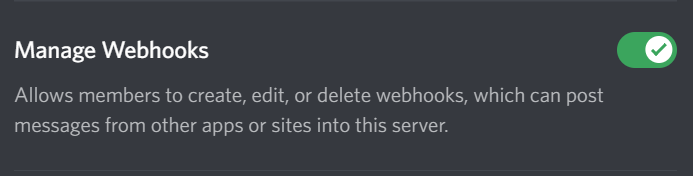

# Deiussum.DiscordComics
This project contains some python scripts that can be used to post the latest XKCD and/or Penny Arcade comics to a discord channel.  To use these scripts:

# Quick install instructions

1. Create a webhook in Discord
2. Clone this repo
3. Create a .env file in the root folder of the repo or create environment variables for PENNY_HOOK and XKCD_HOOK that is set to the web hooks you created in step 1
4. Install latest python 3.x
5. Install the required python modules using pip
    - requests
    - pyquery
    - python-dotenv
6. Setup a scheduler to run the XKCD/Penny Arcade scripts at regular intervals when the new comics are usually released

# Detailed install instructions

## Create a webhook in Discord

Before you can create a webhook in Discord, you will need to be in a role that has the Manage Webhooks permission.  This can be setup under Server Settings -> Roles.

To create a web hook in Discord, go to the "Edit Channel" of the channel you want the web hook to post in and select the Integrations option.  Under web hooks you click on New Webhook.  Give it a meaningful name and if you wish, you can also set the profile picture that will be used by the webhook.

Use the Copy Webhook URL to copy the URL to your clipboard.  The URL will be used below.

## Clone the repo

Using your favorite git client, clone https://github.com/deiussum/Deiussum.DiscordComics.git.

If you have the git command line installed, you can simply type the following from whichever directory you want to create the project in:

    git clone https://github.com/deiussum/Deiussum.DiscordComics.git

## Create a .env file

Using your favorite text editor, create a file that looks something like so:

    PENNY_HOOK=<paste in the webhook URL from your Penny Arcade webhook here>
    XKCD_HOOK=<paste in the webhook URL from your xkcd webhook here>

Note that you can setup a single webhook and use the same URL for both of these.  Using a separate webhook allows you to name them and give them their own profile pictures, though.

## Install python 3.x

How you install Python depends on your operating system.  Visit [Python.org](https://www.python.org) for instructions.

## Install required python modules

You can install the required python modules by using the following command-line commands:

    python -m pip install requests
    python -m pip install pyquery
    python -m pip install python-dotenv

## Setup a scheduler

Setting up a scheduler depends on what operating system you are using.  Each comic can be scheduled indidually, or you can create a script that runs them all.  Currently, the comics that can be posted include:

- Penny Arcade - python PennyArcadeBot.py
- xkcd - python XkcdBot.py

New comics for these are posted on Mondays, Wednesdays, and Fridays.  Penny Arcade seems to be published fairly regularly, but the exact xkcd publish time seems to be sporadic, so you may want to schedule it to try multiple times.  The script is designed in a way that it can be run multiple times and will only make a new post to Discord if the comic has changed since the last time it posted to Discord.

### Linux crontab example

If you are using Linux to schedule the comics. You can use cron.  To edit your crontab file use:

    crontab -e

To add a line to the crontab file, you can use something like this to run a script every hour on Mon,Wed,Fri:

    0 * * * 1,3,5 python /home/username/path-to-script/script

